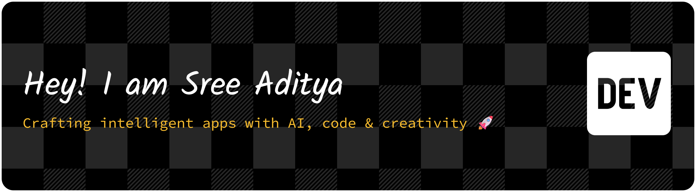

<!-- Visitor Badge -->
 

<!-- Banner -->

  

---

<h1 align="center">👋 Hey, I'm V Sree Aditya</h1>
<h3 align="center">🚀 Passionate Web Developer | AI Enthusiast | IoT Innovator</h3>

---
## 💫 About Me

🎓 **Student at Shiv Nadar University, Chennai**  
🚀 Passionate about **Web Development, AI, and IoT**  
💡 I love **building innovative projects** and solving real-world problems!  
💻 Skilled in **Full Stack Development, AI, and Blockchain**  
🎯 Always exploring new **tech stacks & open-source contributions**

---

## 👯 Looking to Collaborate On
- 🌐 **Web Development Projects**  
- 💻 **Open Source Contributions**  
- ⚡ Anything fun and creative in the tech world!  
📫 Reach me at **@SreeAditya-Dev**

---

## 🤝 Need Help With
- 🧠 **Advanced Web Development Methods**  
- 🌍 Exploring new boundaries in **Web 4.0 technologies**

---

## 🌱 Currently Learning
- 🧩 Full Stack Web Development  
- 📱 Flutter App Development  
- 🎨 Blending **creativity** and **technology** for impactful results

---

## 💬 Ask Me About
- 💡 **C Programming, Python**  
- 🎥 **Motivational Content Creation**  
- 🧠 Latest **Tech Innovations**

---

## ⚡ Fun Facts
- 🧩 Can solve a **Rubik’s Cube** while brainstorming my next project  
- 🧮 Love solving **Sudoku** puzzles in my free time

---

<h2 align="center">📧 Reach Out to Me</h2>

 
  
  

---

## 🌐 Socials

  
 
 
 
 
 

---

<h2 align="center">💻 Tech Stack</h2>

### 🧠 Languages  

### 🎨 Frontend  

### ⚙️ Backend  

### 🗄️ Database & Cloud  

### 🤖 Machine Learning  

### 🧰 Tools  

---

## 📊 GitHub Stats

---

<h2 align="center">🐍 My Contributions</h2>

  

---

## 🏆 GitHub Trophies

  

---

### ✍️ Random Dev Quote

  

---

### 🔝 Top Contributed Repo

  

---

### 📊 Activity Graph

  

---

  
  
  

